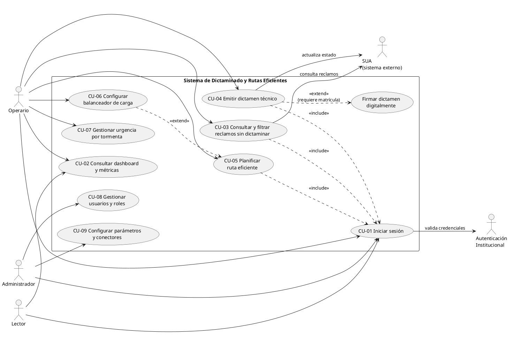
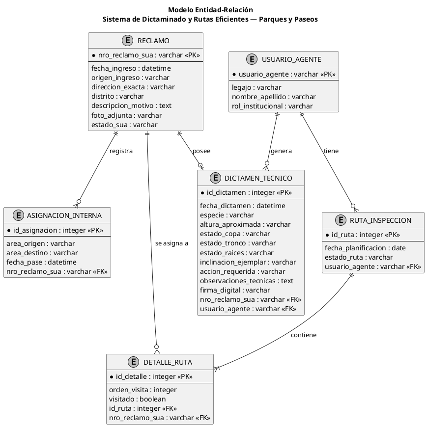
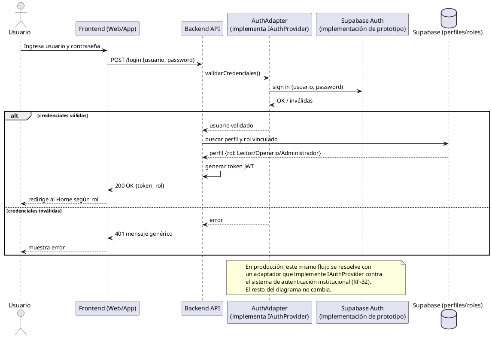
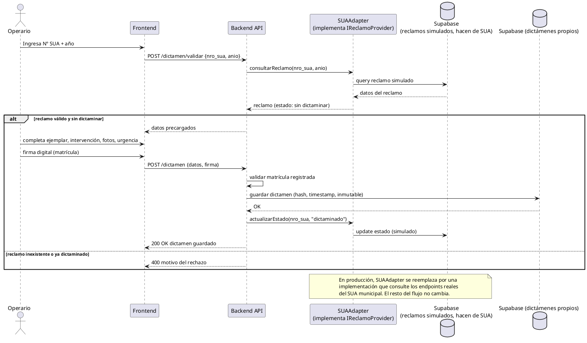
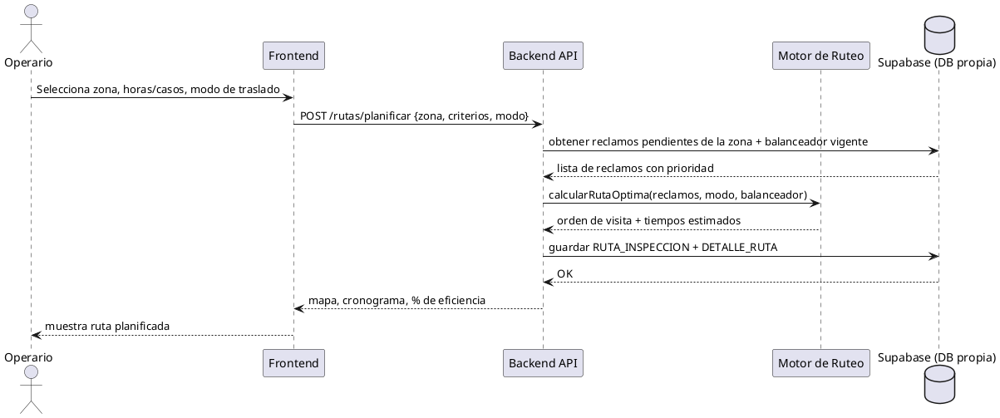
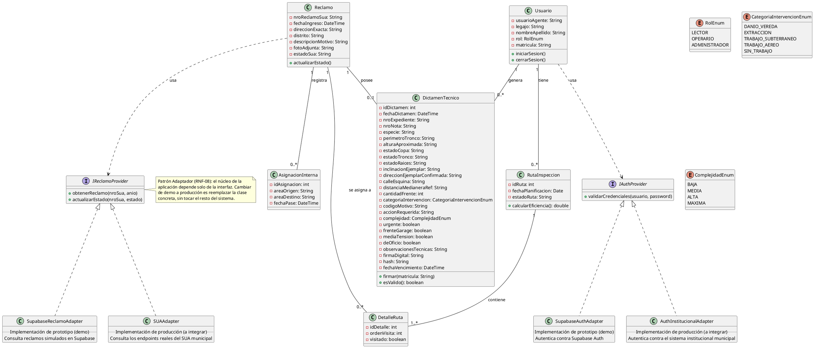
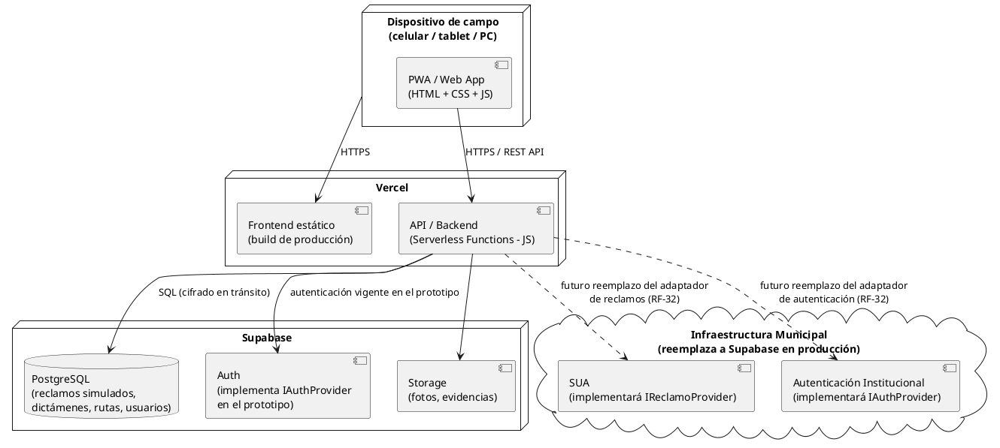
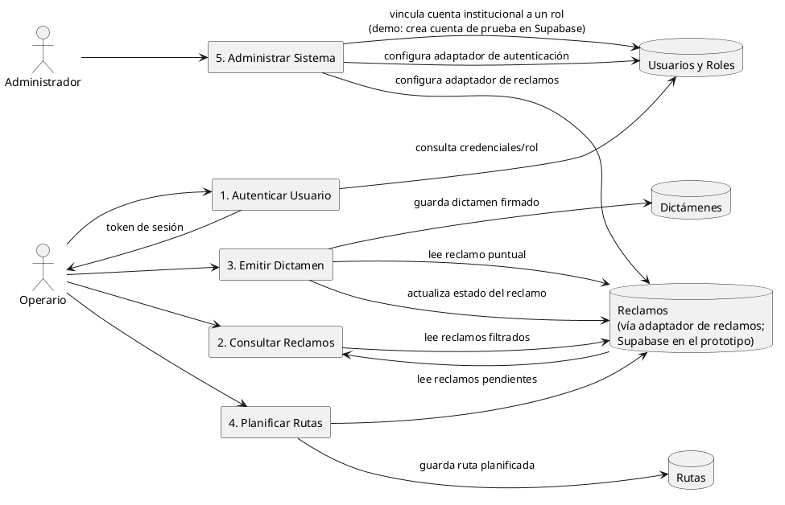

# Documentación técnica — Dirección Técnica de Arbolado

Terciario Urquiza

Técnico superior en análisis funcional de sistemas informáticos

Materia:

Desarrollo web

Tema:

TP Parcial - Primera parte

Alumnos:

Boubonis, Gabriel

Maschio, Alejandro

Pizzicatti, Gianluca

Villega, Lucas

Docente:

Pedernera, Pablo

Rosario, junio 2026

## 1. Descripción del sistema y contexto real.

### 1.1. Origen del proyecto.

Durante el año 2025, el grupo se encargó de realizar un relevamiento de la repartición de Parques y Paseos, analizando los distintos sistemas y procesos utilizados, así como también identificando problemáticas y posibles oportunidades de mejora. Todo este trabajo quedó documentado en la documentación técnica presentada en la materia Práctica Profesionalizante I.

Una vez finalizado y presentado el relevamiento a los directivos de la repartición, se obtuvo la autorización para desarrollar una aplicación orientada a resolver una de las problemáticas detectadas y dar respuesta a una de las propuestas de mejora planteadas durante el análisis.

El proyecto surgió inicialmente de la necesidad de organizar y vincular los contenidos trabajados en las materias Práctica Profesionalizante I y Desarrollo de Sistemas. A partir de esta necesidad, el grupo decidió trabajar con la Dirección General de Parques y Paseos.

La elección de esta repartición fue posible gracias a que uno de los integrantes del grupo, Gabriel Boubonis, se desempeña laboralmente en dicha institución. Esto permitió contar con acceso directo para realizar entrevistas, relevar información, observar procesos de trabajo y visitar las instalaciones, facilitando así la obtención de información necesaria para el análisis y posterior desarrollo del sistema.

### 1.2. Alcance del sistema

El sistema a desarrollar tiene como objetivo cubrir parte del proceso de trabajo relacionado con la gestión y dictaminación de reclamos dentro de la Dirección General de Parques y Paseos. Cabe destacar que el sistema acotará su universo de entrada exclusivamente a las solicitudes provenientes del SUA (Sistema Único de Atención Ciudadana —la plataforma informática transversal a toda la Municipalidad de Rosario—) clasificadas bajo el Tipo: Reclamo y Subtipo: Problemas con el arbolado público, omitiendo cualquier otra categoría.

Las funcionalidades contempladas dentro del alcance del sistema son las siguientes:

- Permitir el acceso al sistema mediante usuario y contraseña institucional.

- Consultar y visualizar reclamos pendientes de dictaminación que correspondan estrictamente al subtipo de arbolado público.

- Realizar dictámenes técnicos, generando la documentación necesaria para autorizar la intervención sobre el ejemplar correspondiente.

- Crear rutas de recorrido eficientes para optimizar la tarea de dictaminar en campo.

- Consultar y visualizar reclamos urgentes identificados con la etiqueta “Protocolo de tormenta”.

- Visualizar e interactuar con un dashboard que permite obtener métricas e información estadística relacionada con el trabajo realizado.

El sistema está orientado principalmente al personal técnico encargado de la inspección y gestión de reclamos vinculados al arbolado público, buscando mejorar la organización, optimización de recorridos y acceso a la información necesaria para la toma de decisiones.

### 1.3. Contexto tecnológico y decisiones de diseño relevantes

Actualmente, la Dirección General de Parques y Paseos enfrenta un escenario complejo caracterizado por un alto volumen de solicitudes acumuladas en el sistema informático central (SUA), registrándose expedientes en curso con más de tres años de antigüedad. Debido a que el SUA es un sistema informático macro desarrollado para dar soporte a toda la estructura de la Municipalidad de Rosario, la repartición de Parques y Paseos representa solo una pequeña porción dentro de este gran ecosistema y utiliza únicamente un módulo parametrizado para sus tareas. Al ser una plataforma global, el SUA no cubre las particularidades operativas, logísticas ni técnicas de la gestión forestal, limitando la capacidad de respuesta ágil del área.

Frente a este escenario, es necesario aclarar que el presente proyecto no pretende ser una solución integral ni mágica a la totalidad del retraso histórico de la repartición. Su objetivo estratégico es actuar como una herramienta técnica complementaria que ataca directamente los principales cuellos de botella del proceso actual, justificando su impacto en tres pilares fundamentales:

- Optimización de Recursos y Tiempos de Campo: La generación de rutas eficientes dota a los ingenieros agrónomos de una herramienta práctica para planificar sus recorridos en el territorio, reduciendo drásticamente los tiempos de traslado y el gasto de recursos logísticos.

- Eliminación del Cuello de Botella Administrativo: Al integrar la validación digital, se reduce el tiempo de procesamiento y actualización del reclamo (eliminando la necesidad de transcribir manualmente del papel al software), acelerando el ciclo de vida del trámite.

- Sustentabilidad y Despapelización: El sistema responde de manera directa a los lineamientos institucionales orientados a la despapelización de la administración pública, promoviendo procesos virtuales que anulan la necesidad de archivos físicos y disminuyen el impacto ambiental.

En conclusión, el sistema se justifica como un dinamizador tecnológico: permite al personal visualizar los casos críticos de una mejor manera, optimiza el trabajo de campo y aporta eficiencia y practicidad allí donde el flujo actual se encuentra retenido por limitaciones de la estructura informática macro.

### 1.4. Decisiones de arquitectura y diseño técnico

​A partir del relevamiento realizado en la Dirección General de Parques y Paseos, se identificaron cuatro condiciones clave del entorno operativo y tecnológico que impactan directamente en la arquitectura y el diseño del sistema:

- ​Validación de Dictámenes Técnicos (Firma Digital): Actualmente, los dictámenes técnicos se emiten en formato papel y requieren la firma hológrafa del ingeniero agrónomo responsable. Para garantizar la transición hacia un entorno digital (paperless) y asegurar la validez legal del documento virtual, el sistema integrará un módulo de firma digital/electrónica para los profesionales autorizados.

- ​Autenticación Centralizada: La repartición utiliza un mecanismo de identidad y permisos unificado para sus servicios internos. Por lo tanto, el acceso al sistema se acoplará a la cuenta institucional existente (usuario, contraseña y permisos), delegando la gestión y el registro de usuarios a la infraestructura actual de la organización.

- ​Integración de Datos (Conexión con SUA): El acceso, consulta y visualización de las solicitudes no requerirá el diseño de un modelo de datos propio para los reclamos. El sistema interactuara de manera directa con la base de datos centralizada del SUA (Sistema Único de Atención Ciudadana), consumiendo la información allí alojada. Para garantizar la eficiencia del prototipo, se aplicará un filtro en la capa de integración que extraerá únicamente las solicitudes parametrizadas como "Reclamo - Problemas con el arbolado público", asegurando que el personal técnico visualice sólo los casos que requieren dictamen forestal.

- ​Heterogeneidad en la Información de Entrada: Dado que los reclamos por arbolado público ingresan a través de múltiples canales ciudadanos, la cantidad y calidad de los datos es variable (algunos incluyen registros fotográficos y descripciones detalladas, mientras que otros son mínimos). El diseño de la interfaz de usuario será flexible y adaptable para mostrar correctamente la información disponible en cada caso.

Desacoplamiento y Mantenibilidad del Sistema

Como decisión estratégica de diseño de software para este proyecto, la aplicación se desarrollará bajo un enfoque desacoplado y modular. La lógica de negocio específica de la gestión de arbolado y dictámenes se mantendrá completamente aislada de los proveedores tecnológicos de la base de datos de reclamos (SUA) y del sistema de autenticación de usuarios.

Esta arquitectura responde a una limitación técnica y de seguridad propia del contexto real: debido a la falta de acceso a los permisos, credenciales y endpoints de producción de la infraestructura informática municipal durante esta etapa, el prototipo no puede conectarse de forma directa a los servicios oficiales. En caso de que la repartición decida adoptar e implementar este desarrollo de manera definitiva, la integración final dependerá únicamente de que el área técnica correspondiente configure y vincule estos dos conectores específicos (base de datos de reclamos y repositorio de usuarios) a sus servicios internos, dejando el resto del núcleo de la aplicación intacto y operativo.

## 2. Identificación de stakeholders.

A continuación, se identifican las partes interesadas relevantes para el sistema de Dictaminado y Rutas Eficientes. Para cada una se describe su rol y se justifica su importancia estratégica para el proyecto.

### 2.1. Vecino solicitante

Es el ciudadano que reporta una necesidad de servicio o intervención sobre un ejemplar del arbolado público de Rosario (ya sea en la vereda de su domicilio o en cualquier otro espacio de la ciudad). Este actor detecta la problemática e inicia el circuito al ingresar la solicitud al sistema general.

- ¿Por qué es clave? Es el usuario externo que justifica la existencia de la repartición. Al demandar un servicio, espera una respuesta ágil y eficiente. Si el sistema optimiza los tiempos de dictaminación internos, el impacto directo se reflejará en una solución más rápida para el ciudadano, preservando el valor y la confianza en la gestión pública.

### 2.2. Director administrativo

Es la autoridad máxima encargada de supervisar el circuito administrativo, los tiempos de resolución y la optimización de los recursos de la Dirección. Monitorea periódicamente el estado de los trámites y analiza los indicadores de rendimiento del área.

- ¿Por qué es clave? Su validación es indispensable para la aprobación e implementación institucional del proyecto. Como conoce en detalle las demoras del flujo actual, es el principal interesado en contar con una herramienta complementaria que centralice métricas e información estadística (dashboard) para la toma de decisiones estratégicas.

### 2.3. Área de Diagramación de Datos

Es la oficina interna responsable de la recepción, clasificación, derivación y seguimiento administrativo de los reclamos que ingresan a la repartición. Actualmente, actúan como un nexo manual crítico en el ciclo de vida del trámite: reciben los dictámenes técnicos emitidos por los ingenieros agrónomos en formato papel, buscan cada solicitud correspondiente dentro del SUA y transcriben manualmente la información del papel al formato digital para poder actualizar y cerrar las actuaciones. Debido a la falta de herramientas específicas de gestión dentro del ecosistema municipal, el área se ve obligada a llevar planillas de cálculo paralelas e independientes para mantener un orden operativo.

- ¿Por qué es clave? Es un actor operativo neurálgico del circuito. Al ser el eslabón encargado de la carga de datos, sufre directamente la ineficiencia del traspaso "papel-a-digital" y la duplicación de tareas. La implementación del nuevo sistema impactará de manera directa en su labor, ya que al automatizar la digitalización y vinculación del dictamen desde el origen, se eliminará la carga manual de datos, mitigando el riesgo de errores de transcripción y permitiéndoles enfocarse en la agilización del flujo administrativo.

### 2.4. Dirección Técnica de Arbolado

Es el área técnica especializada y el principal actor afectado positivamente por la implementación del nuevo sistema. Su participación activa fue la base para el diseño de la aplicación, aportando la información relevada en entrevistas, mesas de trabajo y el análisis del histórico de dictámenes técnicos. A partir de este diagnóstico, se identificaron los aciertos y las fallas operativas que causan los prolongados tiempos de demora desde el ingreso de un reclamo hasta su efectiva resolución.

La Dirección Técnica es un eslabón crítico en el ciclo de vida del reclamo: de acuerdo con la Ordenanza Nº 5.118 y la normativa integral de arbolado urbano (Ordenanza de Arbolado Público), respaldadas por la Ley Provincial del Árbol Nº 13.836 y la Ley Provincial Nº 9.004, ninguna cuadrilla operativa puede intervenir un ejemplar sin el aval y la firma de un dictamen técnico previo.

- ¿Por qué es clave? Es el stakeholder con mayor interés estratégico en el proyecto. El sistema les proveerá una herramienta integral para reordenar las prioridades de trabajo con criterios claros, planificar rutas eficientes y optimizar la distribución de los recursos técnicos y humanos en el territorio. Asimismo, facilitará la estructuración de planes de poda y extracciones según la estacionalidad del año, reduciendo el rezago administrativo y agilizando el cumplimiento de los marcos legales vigentes.

### 2.5. Centro de Informática Local (CIL)

Es el área tecnológica interna encargada de dar soporte, gestionar la infraestructura y velar por la seguridad de los sistemas de la organización. Su intervención en este proyecto se acota a la fase de despliegue, integración y mantenimiento de la plataforma.

- ¿Por qué es clave? Su rol es fundamental para viabilizar la transición del prototipo al entorno real de producción. Serán los responsables de configurar los conectores y adaptadores para vincular la aplicación con las bases de datos institucionales correspondientes y de desplegar la aplicación en los dispositivos móviles corporativos asignados al personal de campo. Adicionalmente, asumirán la gobernanza del sistema, garantizando su mantenimiento correctivo y preventivo, y brindando capacitaciones técnicas o soporte operativo a los usuarios internos en caso de ser requerido.

## 3. Modelo de roles y permisos

Se definen tres roles de sistema:

| Rol | Descripción | Acceso |
| --- | --- | --- |
| Lector | Consulta pasiva, sin edición | Solo Home / Dashboard (RF-03, RF-04, RF-05) |
| Operario | Rol operativo pleno | Reclamos sin dictaminar, Emitir dictamen, Rutas eficientes, Urgencia por Tormenta, Dashboard. Dentro de este rol, solo quienes tengan matrícula profesional registrada en su perfil pueden firmar dictámenes (RF-18) |
| Administrador | Personal del CIL (Centro de Informática) | Gestión de usuarios y roles, configuración de conectores/adaptadores externos, parámetros del sistema (umbrales, tiempos, perfiles de distribución), placeholder de certificación de firma digital |

## 4. Requerimientos funcionales y no funcionales

### 4.1 Requerimientos funcionales

##### Autenticación y acceso

| ID | Descripción | Prioridad |
| --- | --- | --- |
| RF-01 | El sistema debe autenticar al usuario con credenciales institucionales: validar usuario y contraseña antes de habilitar cualquier función, generar un token de sesión (JWT) válido, rechazar todo acceso a páginas internas sin token vigente y, ante credenciales incorrectas, mostrar un mensaje de error genérico sin revelar cuál de los dos campos falló. | Alta |
| RF-02 | El sistema debe gestionar la sesión y los permisos por rol: Lector (solo lectura del dashboard), Operario (gestión completa de reclamos, dictámenes, rutas y protocolo de tormenta) y Administrador (gestión de usuarios, roles y configuración del sistema, incluyendo adaptadores de conexión externa). Dentro del rol Operario, únicamente los usuarios con matrícula profesional registrada en su perfil podrán confirmar y firmar dictámenes técnicos (ver RF-18). El sistema debe permitir cerrar sesión invalidando el token activo y exigir nueva autenticación para reingresar. | Alta |

##### Home / Dashboard

| ID | Descripción | Prioridad |
| --- | --- | --- |
| RF-03 | El sistema debe mostrar en el inicio tres métricas numéricas actualizadas: total de reclamos ingresados, reclamos sin dictaminar y reclamos dictaminados. | Alta |
| RF-04 | El sistema debe mostrar gráficos de apoyo a la gestión: un gráfico de barras con los reclamos pendientes agrupados por nivel de prioridad (verde, amarillo, naranja, rojo) y un gráfico de distribución de reclamos por distrito o zona geográfica. | Media |
| RF-05 | El sistema debe mostrar alertas operativas en el inicio: cantidad de dictámenes próximos a vencer (a 30 días o menos del límite de 18 meses) y un indicador (badge) con la cantidad de casos pendientes etiquetados como “Protocolo Tormenta”. | Media |
| RF-06 | El sistema debe ofrecer accesos directos desde el inicio a las páginas de Reclamos sin dictaminar, Realizar dictamen y Rutas eficientes. | Baja |

##### Reclamos sin dictaminar

| ID | Descripción | Prioridad |
| --- | --- | --- |
| RF-07 | El sistema debe listar únicamente los reclamos derivados/asignados a la Dirección Técnica de Arbolado en estado “sin dictaminar”, ordenándolos de forma predeterminada por nivel de prioridad descendente (urgente → alta → media → baja). | Alta |
| RF-08 | El sistema debe mostrar en cada reclamo, como mínimo, número de SUA, año, dirección del ejemplar, descripción, prioridad actual y fecha de ingreso, presentando la fotografía cuando el reclamo la incluya. | Alta |
| RF-09 | El sistema debe permitir filtrar el listado por prioridad, zona/distrito, tipo de intervención solicitada y antigüedad del reclamo, de forma combinable. | Media |
| RF-10 | El sistema debe permitir iniciar el dictamen de un reclamo directamente desde su tarjeta mediante un botón “Dictaminar este reclamo”, trasladando los datos del reclamo al formulario. | Alta |
| RF-11 | El sistema debe recalcular y elevar automáticamente la prioridad de los reclamos no dictaminados según el escalamiento por tiempo (verde→amarillo→naranja→rojo), aplicando los umbrales temporales configurados para evitar que reclamos antiguos queden olvidados. | Media |

##### Realizar dictamen técnico

| ID | Descripción | Prioridad |
| --- | --- | --- |
| RF-12 | El sistema debe exigir como primer paso obligatorio el ingreso del número de SUA y el año del reclamo, validar que ese par corresponda a un reclamo existente y sin dictaminar y, en caso contrario, impedir continuar mostrando el motivo del rechazo. | Alta |
| RF-13 | El sistema debe permitir cargar los datos del ejemplar evaluado: dirección exacta, especie, diámetro/perímetro del tronco, problemática observada y observaciones complementarias. | Alta |
| RF-14 | El sistema debe permitir seleccionar el tipo de intervención (poda, extracción, corte de raíces u otras autorizadas) y bloquear las combinaciones mutuamente excluyentes: al elegir extracción debe deshabilitar poda y corte de raíces (y viceversa), impidiendo confirmar el dictamen hasta corregir la inconsistencia. | Alta |
| RF-15 | El sistema debe permitir clasificar el dictamen por nivel de urgencia (urgente, corto, mediano o largo plazo) y por complejidad (baja, media, alta, máxima), aceptando un único valor por campo y bloqueando combinaciones contradictorias, en línea con la escala real utilizada en el formulario físico de dictamen técnico. | Alta |
| RF-16 | El sistema debe sugerir y registrar la época recomendada de intervención en función de la estación del año y la especie del ejemplar (p. ej. poda en período fisiológicamente apto), dejándola disponible como criterio de planificación. | Media |
| RF-17 | El sistema debe permitir adjuntar una o más fotografías tomadas en el lugar y registrar la geolocalización del ejemplar (opcional según disponibilidad del dispositivo). | Media |
| RF-18 | El sistema debe requerir, para confirmar el dictamen, la firma digital del ingeniero (captura táctil) junto con su matrícula registrada, impidiendo firmar a todo usuario que no posea matrícula de ingeniero registrada. | Alta |
| RF-19 | El sistema debe registrar automáticamente la fecha de emisión, calcular la fecha de vencimiento a los 18 meses y, una vez firmado, dejar el dictamen en estado de solo lectura (inmutable), almacenando con sello de tiempo, matrícula y hash del documento. | Alta |
| RF-20 | El sistema debe actualizar el estado del reclamo de “sin dictaminar” a “dictaminado” al guardar el dictamen firmado, asociándolo de forma unívoca al reclamo correspondiente. | Alta |

##### Rutas eficientes

| ID | Descripción | Prioridad |
| --- | --- | --- |
| RF-21 | El sistema debe permitir seleccionar la zona/área de la ciudad y planificar la jornada por horas de trabajo o por cantidad de casos a dictaminar, utilizando un tiempo estimado de 10 minutos por dictamen (parámetro configurable) para el cálculo. | Alta |
| RF-22 | El sistema debe permitir elegir el modo de traslado (auto, a pie o bicicleta) y generar la ruta más eficiente posible minimizando el tiempo total de recorrido —sin imponer una distancia máxima rígida entre casos—, partiendo de Parques y Paseos y regresando a Parques y Paseos. | Alta |
| RF-23 | El sistema debe incorporar un balanceador de carga de trabajo por sesión que permita ajustar la distribución de reclamos por nivel de prioridad mediante porcentajes (controles deslizables) y ofrecer modos predefinidos: urgentes primero, por porcentaje definido por el jefe y automático equilibrado. | Alta |
| RF-24 | El sistema debe permitir configurar de forma rápida perfiles/presets de distribución para responder a directivas superiores (“bajada de línea”), incluyendo la posibilidad de asignar el 100% de la jornada a una sola prioridad (p. ej. solo urgentes) y guardar/reutilizar dichos perfiles. | Alta |
| RF-25 | El sistema debe redistribuir automáticamente el cupo de la jornada cuando una prioridad solicitada no tenga stock suficiente, completando con reclamos de otras prioridades para no desperdiciar tiempo disponible, y debe poder considerar la época recomendada de intervención (RF-16) como criterio adicional al armar y ordenar la ruta. | Media |
| RF-26 | El sistema debe presentar el resultado de la planificación mostrando la ruta sobre un mapa (Google Maps / Leaflet) con un pin de color por prioridad, un cronograma con horarios estimados de llegada a cada reclamo, el desglose de tiempo de la jornada (traslado vs. dictaminación) y un porcentaje de eficiencia de la ruta. | Alta |
| RF-27 | El sistema debe permitir consultar, desde la página de rutas, el número de SUA y el año de cada reclamo asignado, para que el ingeniero los utilice al iniciar el dictamen en campo. | Media |

##### Urgencia por Tormenta

| ID | Descripción | Prioridad |
| --- | --- | --- |
| RF-28 | El sistema debe mostrar la sección “Urgencia por Tormenta” únicamente cuando existan reclamos derivados con la etiqueta especial de tormenta, listar los casos de los últimos 3 días con filtro por fecha y reflejar en el badge de navegación la cantidad de casos pendientes. | Alta |
| RF-29 | El sistema debe tratar todos los casos de tormenta con la misma prioridad, sin aplicar la distribución por niveles ni el balanceador de carga de las rutas normales. | Alta |
| RF-30 | El sistema debe calcular la ruta de emergencia de tormenta priorizando la mínima distancia/tiempo total recorrido entre los casos seleccionados. | Alta |

##### Rol Administrador

| ID | Descripción | Prioridad |
| --- | --- | --- |
| RF-31 | El sistema debe permitir al rol Administrador vincular una cuenta institucional existente (usuario/contraseña ya gestionados por el organismo) a un rol del sistema (Lector/Operario/Administrador) y, en el caso de Operarios, cargar su número de matrícula profesional. El sistema no gestiona altas de credenciales ni contraseñas: la autenticación y el reseteo de contraseña siguen dependiendo del mecanismo institucional existente, a través del adaptador de autenticación (ver 1.4). Desactivar un usuario en el sistema revoca su acceso a la aplicación sin afectar su cuenta institucional.   Nota de alcance — prototipo académico: dado que el equipo no cuenta con permisos para conectarse a los endpoints reales de la Municipalidad, la demo utiliza una base de datos en la nube (Supabase) donde el Administrador sí puede dar de alta cuentas de prueba con contraseña propia, únicamente a fines de demostración. Esto no representa el comportamiento final: en producción, el conector de autenticación se reemplaza por el adaptador institucional (RNF-08/RNF-12) y el flujo de alta de usuario pasa a ser exclusivamente de vinculación de rol, como describe el párrafo anterior. | Alta |
| RF-32 | El sistema debe permitir al rol Administrador configurar los adaptadores de conexión externa (base de reclamos SUA, autenticación institucional) sin necesidad de modificar el código fuente, dejando preparado —pero no operativo— el módulo de certificación de firma digital (placeholder académico). | Alta |

### 4.2 Requerimientos no funcionales

| ID | Categoría | Descripción | Prioridad |
| --- | --- | --- | --- |
| RNF-01 | Usabilidad / Responsive | La interfaz debe ser totalmente funcional y fluida en celular y tablet (dispositivos de uso principal en campo) y adaptarse también a navegador de escritorio. | Alta |
| RNF-02 | Accesibilidad de despliegue | El sistema debe ser accesible desde una URL pública fija sin requerir instalación de aplicaciones ni configuración previa en el dispositivo. | Alta |
| RNF-03 | Conectividad en campo | El sistema debe operar mediante datos móviles, sin depender del proxy de la red municipal interna. | Alta |
| RNF-04 | Rendimiento | El sistema debe responder a las acciones principales (login, listado, guardado de dictamen, cálculo de ruta) en un tiempo aceptable bajo conectividad variable de campo. | Media |
| RNF-05 | Seguridad de acceso | El acceso debe estar protegido por autenticación con credenciales institucionales y control de sesión por token; ningún recurso interno accesible sin autenticación. | Alta |
| RNF-06 | Integridad y trazabilidad del dictamen | Los dictámenes firmados deben almacenarse como registros inmutables con sello de tiempo, matrícula y hash, impidiendo su modificación posterior. | Alta |
| RNF-07 | Consistencia de datos | El sistema debe garantizar la integridad referencial entre reclamos, dictámenes, ingenieros y rutas, impidiendo dictámenes huérfanos o duplicados sobre un mismo reclamo. | Alta |
| RNF-08 | Mantenibilidad / Desacoplamiento | La lógica de negocio debe estar aislada de los proveedores externos (base del SUA y autenticación municipal); el pase a producción solo debe requerir reconfigurar los conectores sin tocar el núcleo. | Alta |
| RNF-09 | Configurabilidad | Los parámetros de negocio (tiempo por dictamen, umbrales de escalamiento, perfiles de distribución de carga, criterios estacionales) deben ser configurables sin modificar el código fuente. | Alta |
| RNF-10 | Escalabilidad | La arquitectura debe permitir incorporar nuevos módulos o reglas de negocio sin rediseñar el sistema. | Media |
| RNF-11 | Despliegue continuo | El sistema debe desplegarse automáticamente desde el repositorio de control de versiones ante cada actualización de la rama principal. | Media |
| RNF-12 | Compatibilidad con el SUA | El sistema debe estar preparado para consumir los reclamos desde la base del SUA en producción mediante el reemplazo de los endpoints de lectura, sin alterar el resto de la aplicación. | Alta |
| RNF-13 | Despapelización | El sistema debe eliminar la necesidad de soporte físico para la emisión y carga del dictamen técnico. | Media |

## 5. Historias de usuario

| ID | Rol | Historia | Criterios de aceptación |
| --- | --- | --- | --- |
| HU-01 | Ingeniero Agrónomo | Como ingeniero agrónomo, quiero ingresar con mi usuario y contraseña institucional, para acceder de forma segura al sistema desde mi celular en la calle. | Credenciales válidas -> accedo al Home; inválidas -> mensaje de error; sin sesión -> no puedo entrar a ninguna página. |
| HU-02 | Ingeniero Agrónomo | Como ingeniero agrónomo, quiero ver al entrar cuántos reclamos hay ingresados, sin dictaminar y dictaminados, para saber de un vistazo cómo viene la carga de trabajo. | El Home muestra las tres cifras, gráfico por prioridad, dictámenes por vencer y aviso de casos de tormenta. |
| HU-03 | Ingeniero Agrónomo | Como ingeniero agrónomo, quiero ver la lista de reclamos pendientes ordenados por urgencia, para atender primero los más peligrosos. | Solo reclamos asignados y sin dictaminar; ordenados de urgente a baja; filtrables por zona, prioridad, tipo de intervención y antigüedad. |
| HU-04 | Ingeniero Agrónomo | Como ingeniero agrónomo, quiero consultar el número de SUA y el año de cada reclamo de mi ruta, para anotarlos y poder dictaminarlos después en el formulario. | Desde la página de rutas veo esos datos de cada caso asignado. |
| HU-05 | Ingeniero Agrónomo | Como ingeniero agrónomo, quiero completar el dictamen desde el celular frente al árbol, para no volver a la oficina a cargarlo a mano. | Primero ingreso SUA y año; el sistema verifica que exista y esté sin dictaminar; luego completo datos del ejemplar, intervención, fotos y observaciones. |
| HU-06 | Ingeniero Agrónomo | Como ingeniero agrónomo, quiero que el sistema me impida cargar intervenciones contradictorias, para no generar un dictamen incoherente. | Al elegir extracción se bloquean poda y corte de raíces; no puedo confirmar hasta resolverlo. |
| HU-07 | Ingeniero Agrónomo | Como ingeniero agrónomo, quiero que el sistema tenga en cuenta la estación del año y la especie, para programar intervenciones en el momento más conveniente para el ejemplar. | El dictamen registra/sugiere la época recomendada y puede usarse al planificar la ruta. |
| HU-08 | Ingeniero Agrónomo | Como ingeniero agrónomo, quiero firmar digitalmente el dictamen, para que quede como documento válido e inalterable. | Necesito matrícula registrada; tras firmar queda en solo lectura; se guarda fecha, matrícula y hash, y se calcula el vencimiento a 18 meses. |
| HU-09 | Ingeniero Agrónomo | Como ingeniero agrónomo, quiero que el sistema me arme la ruta más eficiente según una zona y mis horas o cantidad de casos, para perder menos tiempo viajando y dictaminar más. | Elijo zona, planifico por horas o cantidad, modo de traslado; 10 min por dictamen; la ruta parte y vuelve a Parques y Paseos; veo mapa, cronograma y eficiencia. |
| HU-10 | Ingeniero Agrónomo | Como ingeniero agrónomo, quiero elegir entre auto, a pie o bicicleta, para adaptar la jornada a la concentración de reclamos, priorizando la eficiencia del recorrido. | En cualquier modo el sistema optimiza la ruta por tiempo total. |
| HU-11 | Ingeniero Agrónomo | Como ingeniero agrónomo, quiero ver aparte los casos de tormenta de los últimos días, para responder a la emergencia con una ruta de mínima distancia. | La sección aparece solo si hay casos etiquetados; todos con igual urgencia; ruta de mínima distancia; badge indica cuántos hay. |
| HU-12 | Jefe / Coordinador | Como jefe de la Dirección Técnica, quiero usar un balanceador para fijar qué proporción de cada prioridad se dictamina por sesión, para orientar el trabajo según la estrategia del momento. | Ajusto porcentajes por prioridad con controles deslizables; si falta stock de una prioridad, el sistema redistribuye. |
| HU-13 | Jefe / Coordinador | Como jefe de la Dirección Técnica, quiero configurar rápido un perfil de distribución cuando hay una directiva superior, para responder a una política puntual (ej. no dejar ningún caso urgente pendiente). | Puedo asignar el 100% de la jornada a una sola prioridad en pocos pasos y guardar/reusar perfiles. |
| HU-14 | Procesamiento de Datos | Como área de Procesamiento de Datos, quiero que los reclamos que derivó (normales o con etiqueta de tormenta) aparezcan en el sistema, para que los ingenieros puedan trabajarlos. | Los derivados se listan como “sin dictaminar”; los de tormenta van a la sección de urgencia; el sistema no genera reclamos propios, solo consume los derivados. |

### 5.1 Tabla de validación INVEST

Criterios: Independiente · Negociable · Valiosa · Estimable · Small (pequeña) · Testeable.

| HU | I | N | V | E | S | T | Observación |
| --- | --- | --- | --- | --- | --- | --- | --- |
| HU-01 Login. | ✔ | ✔ | ✔ | ✔ | ✔ | ✔ | Sin observaciones. |
| HU-02 Dashboard. | ✔ | ✔ | ✔ | ✔ | ⚠ | ✔ | Agrupa métricas + gráficos + alertas; podría dividirse en 2-3 HU más chicas. |
| HU-03 Listado priorizado. | ✔ | ✔ | ✔ | ✔ | ✔ | ✔ | Sin observaciones. |
| HU-04 Consultar N° SUA/año en ruta. | ✔ | ✔ | ⚠ | ✔ | ✔ | ✔ | Valor bajo aislada; podría fusionarse como criterio de aceptación de HU-09. |
| HU-05 Completar dictamen desde el celular. | ✔ | ✔ | ✔ | ⚠ | ⚠ | ✔ | Historia "paraguas"; conviene dividir en sub-HU (datos del ejemplar, tipo de intervención, adjuntos). |
| HU-06 Bloqueo de intervenciones contradictorias. | ✔ | ✔ | ✔ | ✔ | ✔ | ✔ | Sin observaciones. |
| HU-07 Época recomendada según especie/estación. | ✔ | ✔ | ⚠ | ✔ | ✔ | ✔ | Valor secundario (sugerencia, no bloqueante); es válida igual. |
| HU-08 Firma digital. | ✔ | ✔ | ✔ | ✔ | ✔ | ✔ | Sin observaciones. |
| HU-09 Ruta eficiente. | ✔ | ✔ | ✔ | ⚠ | ⚠ | ✔ | Complejidad algorítmica alta; conviene spike técnico antes de estimar. |
| HU-10 Modo de traslado. | ⚠ | ✔ | ✔ | ✔ | ✔ | ✔ | Depende de HU-09 (no se puede probar aislada). |
| HU-11 Casos de tormenta. | ✔ | ✔ | ✔ | ✔ | ✔ | ✔ | Sin observaciones. |
| HU-12 Balanceador de carga. | ✔ | ✔ | ✔ | ⚠ | ⚠ | ✔ | Podría dividirse en "ajustar porcentajes" y "modos predefinidos". |
| HU-13 Perfiles / bajada de línea. | ⚠ | ✔ | ✔ | ✔ | ✔ | ✔ | Depende de HU-12 (reutiliza el balanceador). |
| HU-14 Reclamos derivados visibles | ✔ | ✔ | ✔ | ✔ | ✔ | ⚠ | Criterio de aceptación algo genérico ("para que puedan trabajarlos"); conviene precisar qué campos deben llegar completos. |

## 6. Casos de uso

| Índice de Casos de Uso |  |  |  |
| --- | --- | --- | --- |
| N° | ID | Nombre | Actor primario |
| 1 | CU-01 | Iniciar sesión | Lector / Operario / Administrador |
| 2 | CU-02 | Consultar dashboard y métricas | Lector / Operario / Administrador |
| 3 | CU-03 | Consultar y filtrar reclamos sin dictaminar | Operario |
| 4 | CU-04 | Emitir dictamen técnico | Operario |
| 5 | CU-05 | Planificar ruta eficiente | Operario |
| 6 | CU-06 | Configurar balanceador de carga | Operario |
| 7 | CU-07 | Gestionar urgencia por tormenta | Operario |
| 8 | CU-08 | Gestionar usuarios y roles | Administrador |
| 9 | CU-09 | Configurar parámetros y conectores del sistema | Administrador |

| Caso de uso CU-01 — Iniciar sesión |  |
| --- | --- |
| Descripción | El usuario se autentica con sus credenciales institucionales para acceder al sistema según su rol. |
| Actores | Lector, Operario, Administrador |
| Precondición | El usuario debe estar dado de alta por un Administrador. |
| Postcondición | Se genera un token de sesión (JWT) válido y el usuario accede a las funciones habilitadas para su rol. |
| Flujo Normal |  |
| Actor | Sistema |
| 1 – El usuario ingresa usuario y contraseña institucional. | 2 – El sistema valida las credenciales contra el adaptador de autenticación.   3 – Genera un token de sesión y habilita las funciones según el rol. |
| Flujo Alternativo |  |
| A1 – Credenciales incorrectas: se muestra un mensaje de error genérico sin indicar cuál campo falló. |  |
| Excepciones | Caída del servicio de autenticación institucional · Token expirado durante la sesión. |
| Frecuencia de uso | Muy alta. |
| Prioridad | Alta. |

| Caso de uso CU-02 — Consultar dashboard y métricas |  |
| --- | --- |
| Descripción | El usuario visualiza métricas de reclamos, gráficos de prioridad/distrito y alertas operativas. |
| Actores | Lector, Operario, Administrador |
| Precondición | Sesión iniciada. |
| Postcondición | El usuario visualiza el estado agregado del sistema. |
| Flujo Normal |  |
| Actor | Sistema |
| 1 – El usuario accede al Home. | 2 – El sistema muestra total de reclamos, sin dictaminar, dictaminados, gráfico de prioridad, gráfico por distrito, dictámenes próximos a vencer y badge de tormenta. |
| Flujo Alternativo |  |
| A1 – Si no hay casos de tormenta activos, la sección/badge correspondiente no se muestra |  |
| Excepciones | Falla en el cálculo de métricas por datos inconsistentes. |
| Frecuencia de uso | Muy alta. |
| Prioridad | Alta. |

| Caso de uso CU-03 — Consultar y filtrar reclamos sin dictaminar |  |
| --- | --- |
| Descripción | El Operario consulta el listado de reclamos derivados a la Dirección Técnica, filtrando y ordenando según criterios operativos. |
| Actores | Operario (primario) · SUA (secundario, provee los datos) |
| Precondición | Sesión iniciada con rol Operario. |
| Postcondición | El Operario visualiza el listado priorizado, listo para iniciar un dictamen. |
| Flujo Normal |  |
| Actor | Sistema |
| 1 – El Operario accede al listado. 
4 – El Operario aplica filtros (zona, prioridad, tipo de intervención, antigüedad). | 2 – El sistema consulta al adaptador SUA los reclamos del subtipo sin dictaminar.   3 – Los muestra ordenados por prioridad descendente. |
| Flujo Alternativo |  |
| A1 – Sin resultados para el filtro aplicado: se muestra "sin resultados". |  |
| Excepciones | Adaptador SUA no disponible · Timeout de conexión con datos móviles. |
| Frecuencia de uso | Muy alta. |
| Prioridad | Alta |

| Caso de uso CU-04 — Emitir dictamen técnico |  |
| --- | --- |
| Descripción | El Operario matriculado completa y firma digitalmente el dictamen técnico de un ejemplar. |
| Actores | Operario (primario) · SUA (secundario) |
| Precondición | El reclamo existe en SUA y está sin dictaminar. |
| Postcondición | El dictamen queda registrado, firmado, inmutable y el reclamo pasa a estado "dictaminado". |
| Flujo Normal |  |
| Actor | Sistema |
| 1 – Ingresa N° SUA y año.   3 – El Operario carga datos del ejemplar, tipo de intervención, urgencia/complejidad, fotos y geolocalización.   4 – Firma digitalmente ingresando su matrícula. | 2 – El sistema valida existencia y estado.   5 – El sistema calcula vencimiento (18 meses), genera hash y sello de tiempo, deja el registro en solo lectura.
6 – Actualiza el estado del reclamo en el adaptador SUA. |
| Flujo Alternativo |  |
| A1 – El sistema sugiere época recomendada según especie/estación (RF-16). |  |
| Excepciones | N° SUA/año inexistente o ya dictaminado · Combinación de intervención inconsistente (RF-14) · Usuario sin matrícula registrada intenta firmar. |
| Frecuencia de uso | Media-alta. |
| Prioridad | Alta |

| Caso de uso CU-05 — Planificar ruta eficiente |  |
| --- | --- |
| Descripción | El Operario genera una ruta optimizada de visitas para su jornada de campo. |
| Actores | Operario |
| Precondición | Existen reclamos sin dictaminar disponibles en la zona seleccionada. |
| Postcondición | Se genera una ruta con orden de visita, cronograma estimado y mapa. |
| Flujo Normal |  |
| Actor | Sistema |
| 1 – Selecciona zona, criterio (horas/cantidad de casos) y modo de traslado. | 2 – El sistema calcula la ruta más eficiente (10 min/dictamen configurable), partiendo y volviendo a Parques y Paseos.   3 – Muestra mapa, cronograma, desglose de tiempos y porcentaje de eficiencia. |
| Flujo Alternativo |  |
| A1 – Aplica el balanceador de carga vigente (CU-06) para seleccionar qué reclamos entran en la ruta. |  |
| Excepciones | Sin reclamos suficientes en la zona · Falla del servicio de mapas. |
| Frecuencia de uso | Alta. |
| Prioridad | Alta |

| Caso de uso CU-06 — Configurar balanceador de carga |  |
| --- | --- |
| Descripción | El Operario ajusta la distribución porcentual de prioridades a incluir en una ruta, o aplica/guarda un perfil predefinido. |
| Actores | Operario |
| Precondición | Sesión iniciada con rol Operario. |
| Postcondición | La configuración queda aplicada a la próxima planificación de ruta (CU-05). |
| Flujo Normal |  |
| Actor | Sistema |
| 1 – El Operario ajusta porcentajes por prioridad con controles deslizables, o selecciona un modo predefinido (urgentes primero / por porcentaje / automático equilibrado). | 2 – El sistema valida y guarda la configuración de la sesión. |
| Flujo Alternativo |  |
| A1 – Guardar el ajuste actual como perfil reutilizable · A2 – Si una prioridad no tiene stock suficiente, el sistema redistribuye automáticamente con otras prioridades. |  |
| Excepciones | Suma de porcentajes inconsistente. |
| Frecuencia de uso | Media. |
| Prioridad | Alta. |

| Caso de uso CU-07 — Gestionar urgencia por tormenta |  |
| --- | --- |
| Descripción | El Operario visualiza y genera una ruta de emergencia para los reclamos etiquetados como Protocolo de Tormenta. |
| Actores | Operario · SUA (secundario) |
| Precondición | Existen reclamos derivados con etiqueta de tormenta en los últimos 3 días. |
| Postcondición | Se genera una ruta de emergencia de mínima distancia entre los casos seleccionados. |
| Flujo Normal |  |
| Actor | Sistema |
| 1 – El Operario accede a la sección (visible sólo si hay casos). | 2 – Visualiza los casos, todos con igual prioridad.   3 – Genera la ruta de emergencia de mínima distancia/tiempo. |
| Flujo Alternativo |  |
| No aplica distribución por niveles ni balanceador (RF-29). |  |
| Excepciones | No hay casos de tormenta activos → la sección no se muestra. |
| Frecuencia de uso | Baja (eventual, ligada a eventos climáticos) |
| Prioridad | Alta |

| Caso de uso CU-08 — Gestionar usuarios y roles |  |
| --- | --- |
| Descripción | El Administrador crea, edita o desactiva usuarios y les asigna rol y, si corresponde, matrícula. |
| Actores | Administrador |
| Precondición | Sesión iniciada con rol Administrador. |
| Postcondición | El usuario queda habilitado con el rol y permisos correspondientes. |
| Flujo Normal |  |
| Actor | Sistema |
| 1 – El Administrador crea un usuario.   2 – Asigna rol (Lector/Operario/Administrador.   3 – Si es Operario, opcionalmente carga matrícula profesional. | 4 – El sistema guarda el perfil y habilita el acceso. |
| Flujo Alternativo |  |
| A1 – Desactivar un usuario existente revoca su acceso inmediatamente. |  |
| Excepciones | Matrícula con formato inválido · Usuario duplicado. |
| Frecuencia de uso | Baja. |
| Prioridad | Media |

| Caso de uso CU-09 — Configurar parámetros y conectores del sistema |  |
| --- | --- |
| Descripción | El Administrador configura parámetros de negocio y los adaptadores de conexión externa (SUA, autenticación municipal), y deja preparado el módulo de certificación de firma digital. |
| Actores | Administrador |
| Precondición | Sesión iniciada con rol Administrador. |
| Postcondición | Los parámetros/conectores quedan actualizados sin necesidad de modificar código. |
| Flujo Normal |  |
| Actor | Sistema |
| 1 – El Administrador accede al panel de configuración.   2 – Ajusta parámetros (tiempo por dictamen, umbrales de escalamiento, perfiles) y/o credenciales de los adaptadores externos. | 3 – El sistema guarda y aplica los cambios. |
| Flujo Alternativo |  |
| A1 – Configurar el placeholder de certificación de firma digital (sin certificar realmente, por ser un proyecto académico). |  |
| Excepciones | Excepciones: Credenciales de conector inválidas · Parámetro fuera de rango permitido. |
| Frecuencia de uso | Baja. |
| Prioridad | Media. |

### 6.1. Diagrama de casos de uso.

## 7. Modelo Entidad-Relación.

El siguiente diagrama representa el modelo entidad-relación del sistema de Dictaminado y Rutas Eficientes de la Dirección Técnica de Arbolado. Se incluyen las entidades identificadas durante el análisis, sus atributos principales con sus correspondientes tipos de datos, y las relaciones directas que modelan de forma desacoplada la lógica del sistema frente a la infraestructura municipal.

El código PlantUML puede visualizarse en https://www.plantuml.com/plantuml/uml/

### 7.1. Descripción de entidades

| Entidad | Descripción | Relaciones clave |
| --- | --- | --- |
| RECLAMO | Registro de la solicitud del ciudadano extraído del SUA. Concentra la información de entrada del problema del arbolado público, su ubicación geográfica por distrito y la imagen cargada por el vecino. El atributo estado_sua varía dinámicamente según la fase de intervención en la que se encuentre. | Posee un único DICTAMEN_TECNICO. Se asigna a uno o muchos registros de DETALLE_RUTA. Registra una o muchas ASIGNACIONES_INTERNAS. |
| DICTAMEN_TECNICO | Documento resolutivo con validez legal emitido en formato digital por el ingeniero agrónomo. Almacena las variables fitosanitarias evaluadas en campo (copa, tronco, raíces, inclinación) y la acción definitiva a ejecutar. Es la entidad que formaliza el cierre del circuito técnico. | Pertenece a un único RECLAMO. Es generado por un USUARIO_AGENTE (técnico). |
| USUARIO_AGENTE | Personal municipal autenticado a través de la cuenta institucional corporativa. Su identificador único es el nombre de usuario único de red, el cual arrastra el legajo y rol para determinar permisos dentro de la aplicación. | Genera uno o muchos DICTAMEN_TECNICO. Tiene asignada una o muchas RUTA_INSPECCION. |
| RUTA_INSPECCION | Registro de cabecera logístico que planifica el itinerario de un técnico de campo para una jornada laboral específica. Controla si el circuito diario está pendiente, en curso o finalizado. | Pertenece a un USUARIO_AGENTE. Contiene uno o muchos registros de DETALLE_RUTA. |
| DETALLE_RUTA | Entidad intermedia que desglosa el orden secuencial de paradas de una ruta de inspección. Su existencia permite asociar la planificación con los reclamos geolocalizados del SUA y llevar la trazabilidad del estado de visita individual de cada árbol. | Forma parte de una RUTA_INSPECCION. Referencia a un RECLAMO específico del SUA. |
| ASIGNACION_INTERNA | Historial administrativo que documenta las derivaciones y pases del expediente del reclamo realizados por el Área de Diagramación de Datos hacia las diferentes dependencias internas de la organización. | Es registrada por un RECLAMO. |

### 7.2. Decisiones de diseño destacadas

Las siguientes decisiones de diseño del MER responden a criterios de arquitectura lógicos adaptados al entorno informático municipal:

- Identificación por usuario_agente en lugar de IDs autonuméricos genéricos: Siguiendo las directrices de acoplamiento al sistema de autenticación unificado de la organización, se definió el usuario institucional como clave primaria de la entidad USUARIO_AGENTE. Esto permite asociar de forma directa la autoría y la firma digital del dictamen técnico al legajo de red del agente que operó la aplicación, sin recrear estructuras de usuarios paralelas.

- Creación de la entidad intermedia DETALLE_RUTA: Un reclamo del SUA puede llegar a planificarse en rutas de días distintos si surgen imprevistos operativos en campo (como falta de tiempo o inaccesibilidad del ejemplar). Para resolver la relación de muchos a muchos ($N:M$) resultante, se incorporó DETALLE_RUTA. Esta tabla no solo rompe la relación física, sino que encapsula de forma eficiente atributos transitorios clave como el orden_visita calculado por el algoritmo inteligente y el control booleano de visitado.

- Separación lógica de ASIGNACION_INTERNA: El flujo del trámite en el SUA incluye pases de expedientes entre áreas (ej. del Departamento Técnico a Operativa). Mantener esta información en una tabla histórica vinculada al nro_reclamo_sua asegura que el Área de Diagramación de Datos pueda auditar los movimientos de un caso sin alterar los datos inmutables de la solicitud original.

- Mantenimiento del estado_sua en la tabla de Reclamos: El atributo estado_sua actúa como el disparador del ciclo de vida del trámite, reflejando las "Intervenciones" de los ingenieros agrónomos. Cuando un usuario de rol técnico guarda y firma un registro en DICTAMEN_TECNICO, este campo se actualiza en paralelo, permitiendo que la capa de integración devuelva al ecosistema macro de la municipalidad el nuevo estado (ej. de "Asignado" a "Dictaminado") sin necesidad de realizar consultas pesadas.

## 8. Arquitectura y diagramas del sistema propuesto.

### 8.1. Diagramas de secuencia.

#### 8.1-A. Login.

#### 8.1-B. Emitir dictamen técnico.

#### 8.1-C. Planificar ruta eficiente.

### 8.2. Diagrama de clases.

### 8.3. Diagrama de despliegue.

### 8.4. Diagrama de flujo de datos — Nivel 1

## 9. Referencias y fuentes.

Para el desarrollo, análisis y elaboración de las propuestas de este proyecto, se utilizaron diversos tipos de fuentes de información, clasificadas en normativas legales, herramientas tecnológicas e institucionales, y documentación técnica interna de la Municipalidad de Rosario.

#### 9.1. Normativa Legal y Marcos Regulatorios

- Código de Urbanismo de la Ciudad de Rosario: Marco normativo general que regula la planificación urbana, el uso del suelo y la preservación de los espacios verdes públicos en el municipio.

- Ordenanza Municipal N° 5.118/91 (y modificatorias) - Protección del Arbolado Público: Normativa específica de la ciudad de Rosario que regula la plantación, conservación, poda, extracción y protección de los ejemplares de alineación y de los espacios verdes. Establece la obligatoriedad del dictamen técnico previo para cualquier intervención.

- Decreto de Estructura Orgánica de la Dirección General de Parques y Paseos: Documento e instrumento legal oficial (firmado por la Intendencia) que determina el organigrama formal, las misiones y las funciones de la repartición y sus respectivas subsecretarías.

#### 9.2. Sistemas e Infraestructura Tecnológica de Referencia

- Sistema Único de Atención (SUA) - Municipalidad de Rosario: Plataforma informática centralizada basada en entorno web y base de datos PostgreSQL, utilizada para el registro, derivación, seguimiento y resolución de reclamos ciudadanos.

- Munibot (Chatbot Oficial de la Municipalidad de Rosario): Canal digital de atención ciudadana automatizado que sirve como interfaz de entrada para los reclamos de tipo "Problema con arbolado público".

- Guías de Estructura de Datos y APIs del Centro Informático Local (CIL): Documentación técnica y especificaciones de red (protocolos Proxy, switches Cisco, infraestructura cliente-servidor) provistas por el área informática para analizar los límites de modificación del SUA.

#### 9.3. Documentación Interna y Fuentes Primarias (Relevamiento)

- Formularios y Actas de Dictamen Técnico de Arbolado: Modelos de formularios físicos utilizados por los ingenieros agrónomos de la Dirección Técnica para la evaluación en campo (parámetros de especie, diámetro, criticidad y tipo de intervención).

- Pliegos de Bases y Condiciones para Empresas Concesionarias: Documentación interna que detalla el alcance operativo, los permisos asignados dentro del SUA y las limitaciones regulatorias de las contratistas tercerizadas.

- Minutas de Entrevistas Semiestructuradas (Noviembre 2025):

- Entrevista N° 1: Director Administrativo de la Dirección General de Parques y Paseos.

- Entrevista N° 2: Responsable del Área de Diagramación de Datos.

- Entrevista N° 3: Jefa del Área de Procesamiento de Datos (Centralización).

- Entrevista N° 4: Personal Técnico del Centro Informático Local (CIL).

- Registros de Observación Directa en Campo y Oficinas: Notas de campo recopiladas por el equipo de práctica durante las visitas a la Dirección Técnica, Dirección Operativa y las mesas de entrada de los Distritos Municipales.

#### 9.4. Bibliografía de Apoyo Técnico y Metodológico

- Criterios de Evaluación de Riesgo de Arbolado Urbano (Asociación Internacional de Arboricultura - ISA): Manuales técnicos de referencia internacional utilizados de forma indirecta por los ingenieros agrónomos para determinar las variables de riesgo estructural y fitosanitario en los ejemplares.

- Metodologías de Análisis y Diseño de Sistemas (UML): Guías de modelado para la confección de diagramas de clases, diagramas de casos de uso.
