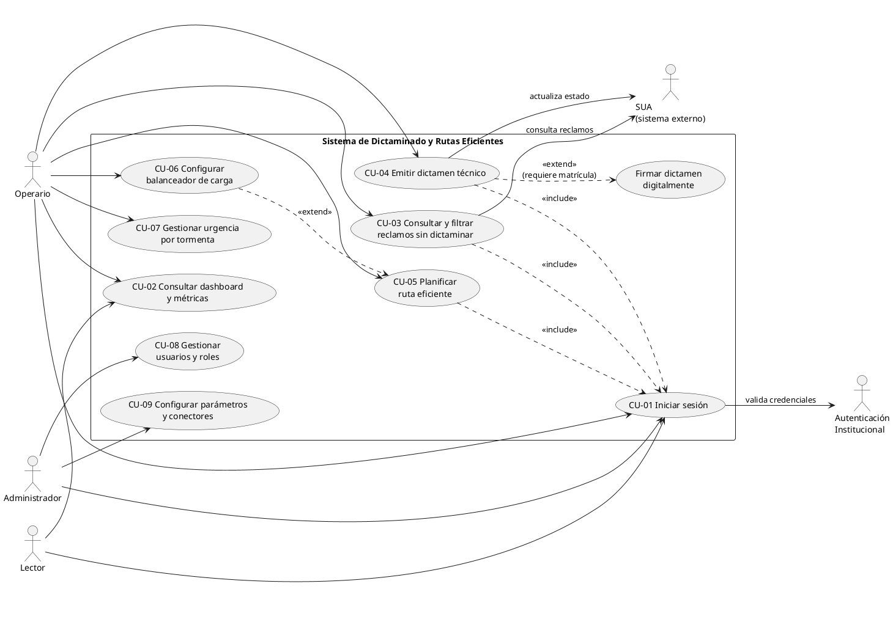
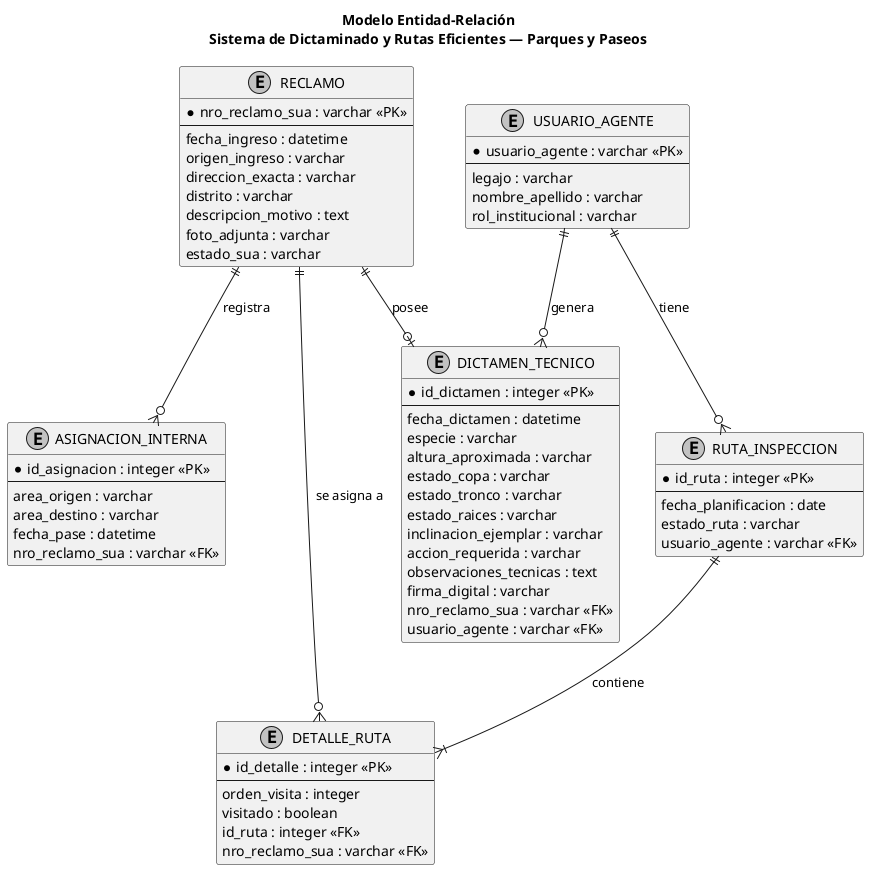
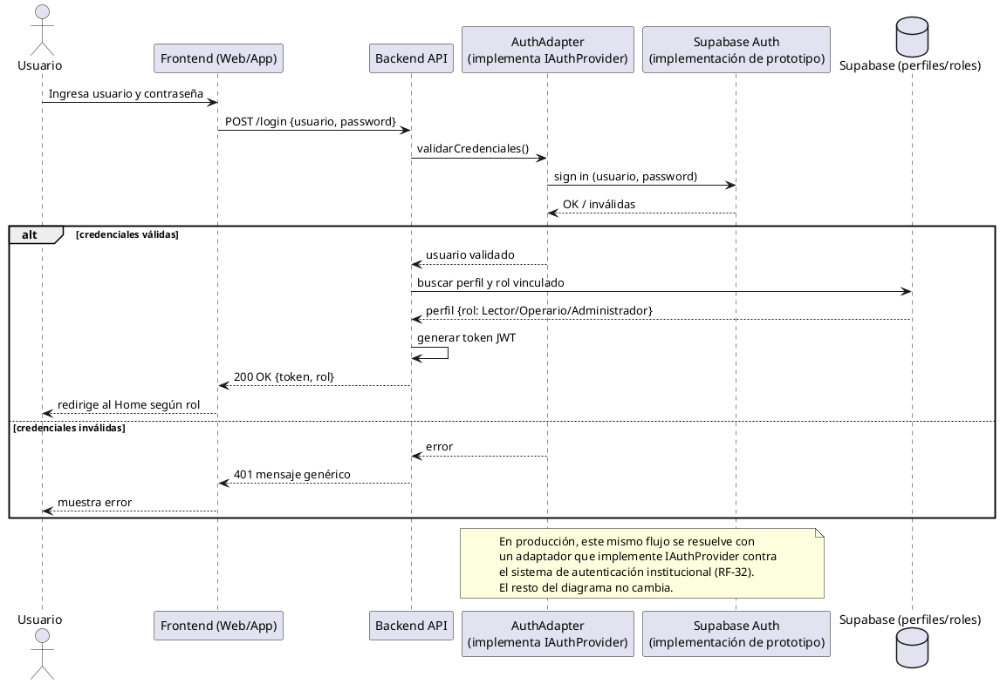
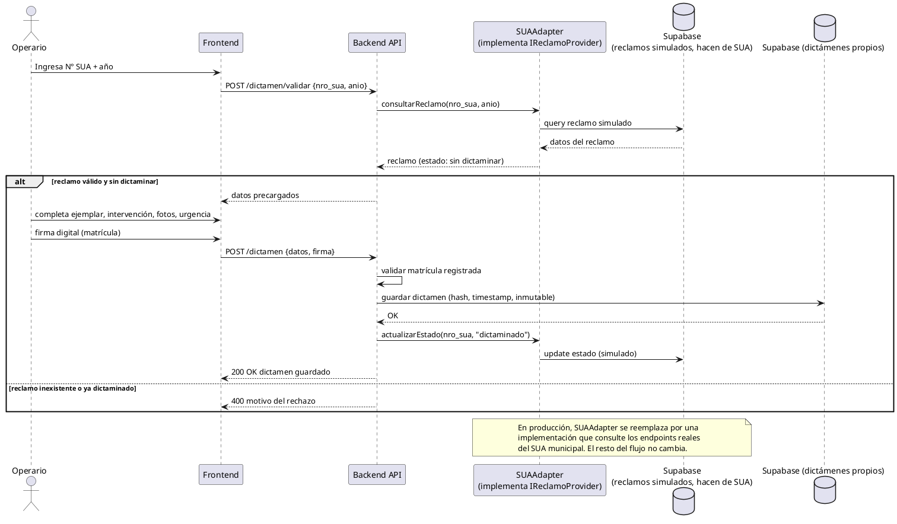
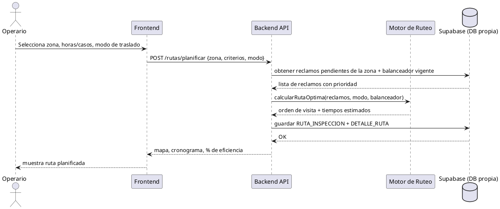
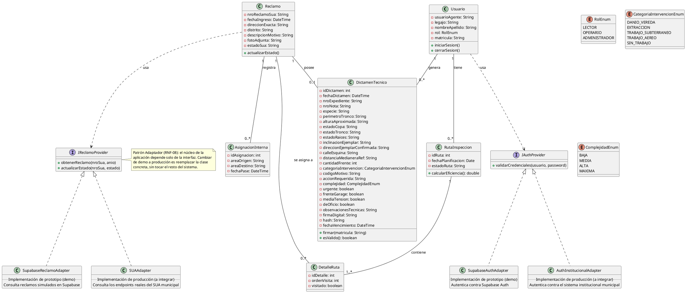
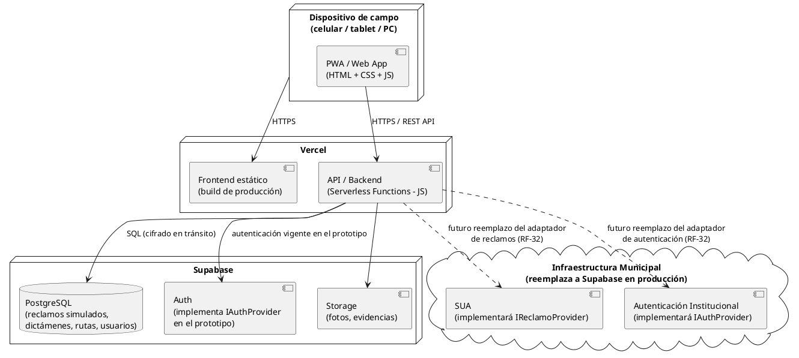
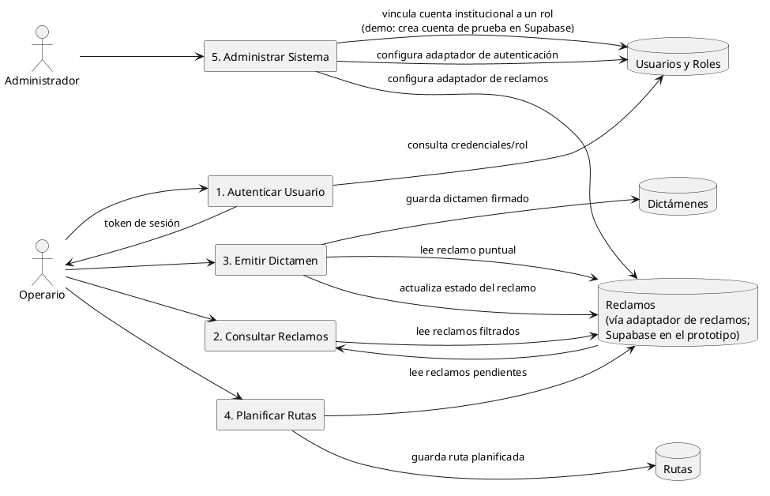

# Diagramas del sistema (fuente PlantUML)

Render online: <https://www.plantuml.com/plantuml/uml/>

Los SVG ya renderizados viven en la raíz del proyecto.

## Diagrama de casos de uso

## Modelo Entidad-Relación

SVG renderizado: `../Diagrama Entidad-Relacion.svg`

## Secuencia — Login

SVG renderizado: `../Login.svg`

## Secuencia — Emitir dictamen técnico

SVG renderizado: `../Emitir dictamen tecnico.svg`

## Secuencia — Planificar ruta eficiente

SVG renderizado: `../Planificar ruta eficiente.svg`

## Diagrama de clases

SVG renderizado: `../Diagrama de clase.svg`

## Diagrama de despliegue

SVG renderizado: `../Diagrama de despliegue.svg`

## Diagrama de flujo de datos — Nivel 1

SVG renderizado: `../Diagrama de flujo de datos - Nivel 1.svg`

